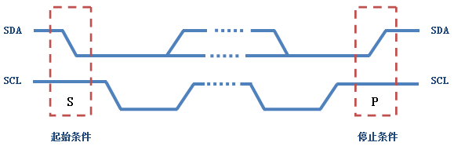
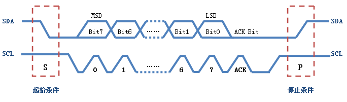
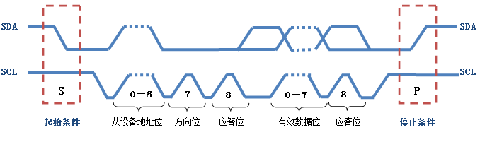
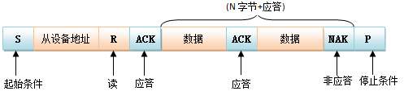
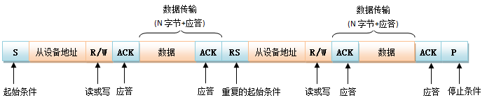

date: 2019-11-15
updated: 2019-11-15
tags: 

- 通讯总线
---

I2C总线协议图解

最近做了个小东西涉及到I2C，重新复习下吧
<!--more-->

转自：[传送门]( https://blog.csdn.net/w89436838/article/details/38660631 )

# 1.I2C总线物理拓扑结构

  

I2C 总线在物理连接上非常简单，分别由SDA(串行数据线)和SCL(串行时钟线)及上拉电阻组成。通信原理是通过对SCL和SDA线高低电平时序的控制，来产生I2C总线协议所需要的信号进行数据的传递。在总线空闲状态时，这两根线一般被上面所接的上拉电阻拉高，保持着高电平。

I2C通信方式为半双工，只有一根SDA线，同一时间只可以单向通信，485也为半双工，SPI和uart为双工。

# 2.I2C总线特征

I2C总线上的每一个设备都可以作为主设备或者从设备，而且每一个设备都会对应一个唯一的地址，地址通过物理接地或者拉高，可以从I2C器件的数据手册得知，如TVP5158芯片，7位地址依次bit6~bit0:x101 1xxx, 最低三位可配，如果全部物理接地，则该设备地址为0x58, 而之所以7bit因为1个bit要代表方向，主向从和从向主)，主从设备之间就通过这个地址来确定与哪个器件进行通信，在通常的应用中，我们把CPU带I2C总线接口的模块作为主设备，把挂接在总线上的其他设备都作为从设备。

I2C总线上可挂接的设备数量受总线的最大电容400pF 限制，如果所挂接的是相同型号的器件，则还受器件地址位的限制。

I2C总线数据传输速率在标准模式下可达100kbit/s，快速模式下可达400kbit/s，高速模式下可达3.4Mbit/s。一般通过I2C总线接口可编程时钟来实现传输速率的调整，同时也跟所接的上拉电阻的阻值有关。

I2C总线上的主设备与从设备之间以字节(8位)为单位进行双向的数据传输。 

# 3.I2C总线协议

I2C协议规定，总线上数据的传输**必须**以一个起始信号作为开始条件，以一个结束信号作为传输的停止条件。起始和结束信号**总是**由主设备产生(意味着从设备不可以主动通信？所有的通信都是主设备发起的，主可以发出询问的command，然后等待从设备的通信)。 

起始和结束信号产生条件：总线在空闲状态时，SCL和SDA都保持着高电平，当SCL为高电平而SDA由高到低的跳变，表示产生一个起始条件；当SCL为高而SDA由低到高的跳变，表示产生一个停止条件。

在起始条件产生后，总线处于忙状态，由本次数据传输的主从设备独占，其他I2C器件无法访问总线；而在停止条件产生后，本次数据传输的主从设备将释放总线，总线再次处于空闲状态。**起始和结束如图所示**：

  

  在了解起始条件和停止条件后，我们再来看看在这个过程中数据的传输是如何进行的。前面我们已经提到过，数据传输以字节为单位。主设备在SCL线上产生每个时钟脉冲的过程中将在SDA线上传输一个数据位，当一个字节按数据位从高位到低位的顺序传输完后，紧接着从设备将拉低SDA线，回传给主设备一个**应答位**， 此时才认为一个字节真正的被传输完成。当然，并不是所有的字节传输都必须有一个应答位，比如：当从设备不能再接收主设备发送的数据时，从设备将回传一个否 定应答位。**数据传输的过程**如图所示： 

  

 在前面我们还提到过，I2C总线上的每一个设备都对应一个唯一的地址，主从设备之间的数据传输是建立在地址的基础上，也就是说，主设备在传输有效数据之前要先指定从设备的地址，地址指定的过程和上面数据传输的过程一样，只不过大多数从设备的地址是7位的，然后协议规定再给地址添加一个最低位用来表示接下来数据传输的方向，0表示主设备向从设备写数据，1表示主设备向从设备读数据。**向指定设备发送数据的格式**如图所示：(每一最小包数据由9bit组成，8bit内容+1bit ACK, 如果是地址数据，则8bit包含1bit方向) 

  

 **下图是完整的一帧I2C数据**： 

  

# 4.I2C总线操作

主机首先通过发送一个START，然后发送它希望与之通信的从机的7位地址，进入主机发送模式，最后发送一个代表它希望写入（0）还是读取（1）的位。 

如果从机存在于总线上，则它将以该地址的ACK位（低电平有效表示应答）响应。然后，主机继续以发送或接收模式（根据其发送的读/写位）继续运行，从机继续以互补模式（分别为接收或发送）继续。

地址和数据字节首先发送最高有效位。起始位由SCL由高到低的SDA指示。SCL为高电平时，SDA由低到高的跳变指示停止位。SDA的所有其他转换都在SCL为低电平的情况下发生。

如果主机希望写入从机，则它会重复发送一个字节，而从机则发送一个ACK位。（在这种情况下，主机处于主机发送模式，而从机处于从机接收模式。）

如果主机希望从从机读取数据，则它会反复从从机接收一个字节，主机会在除最后一个字节以外的每个字节之后发送一个ACK位。（在这种情况下，主机处于主机接收模式，而从机处于从机发送模式。）

I²C事务可能包含多个消息。如果这是事务的结束，则主机以STOP条件终止一条消息，或者它可以发送另一个START条件以保留对另一条消息的总线控制（“组合格式”事务）。

对I2C总线的操作实际就是主从设备之间的读写操作。**大致可分为以下三种操作情况**：

* 主设备往从设备中写数据。数据传输格式如下：

  

*  主设备从从设备中读数据。数据传输格式如下： 

  

*  主设备往从设备中写数据，然后重启起始条件，紧接着从从设备中读取数据；或者是主设备从从设备中读数据，然后重启起始条件，紧接着主设备往从设备中写数据。数据传输格式如下： 

  

 第三种操作在单个主设备系统中，重复的开启起始条件机制要比用STOP终止传输后又再次开启总线更有效率。 大多数I2C器件都支持重复启动条件。这意味着在通信以停止条件结束之前，主设备可以用地址字节重复开始条件，并将模式从写入更改为读取。 
