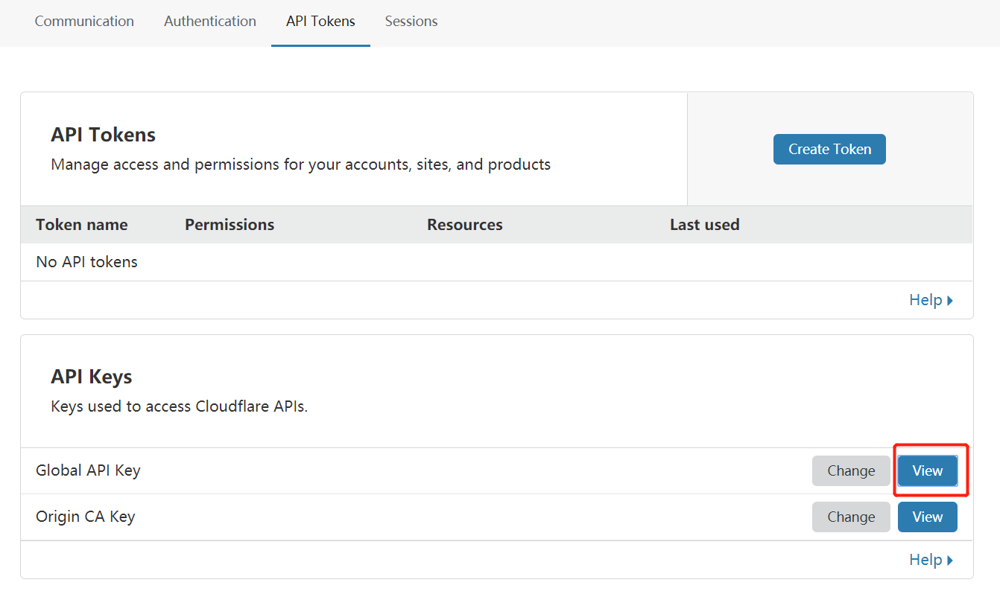
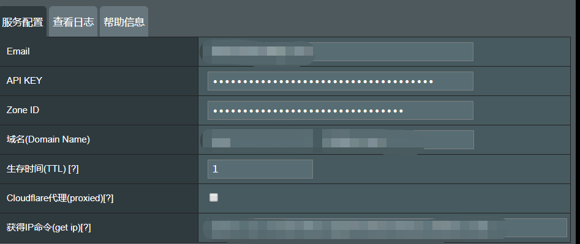

date: 2020-3-10
updated: 2020-3-10
tags: 

- 计算机网络
---

在家里部署了一台群辉的NAS，需要实现外网对家里的群辉进行访问，打电话给电信拿到了公网IP，但是这IP 是动态公网IP，打算搭建Dynamic DNS(DDNS)，把子域名映射到家里的公网IP上。

目前使用的CDN服务商是CloudFlare，配合使用华硕路由器上的插件CloudFlare DDNS，利用CloudFlare设置DDNS获取动态IP

<!--more-->

## STEP1：获取CloudFlare API

如果域名没有使用 CloudFlare 的 DNS 解析服务，首先要在 CloudFlare 按提示添加域名，把域名的 DNS 服务器改为 CloudFlare，增加一个子域名A记录，TTL 可设为 2 分钟或自动。注意，DDNS 使用的域名不要开启 CloudFlare 的 CDN，只用 CF 的 DNS 解析功能，也就是 status 一列对应域名的图标要是灰色的。然后指向的ipv4可以随便先指一个，比如说8.8.8.8

添加好域名解析后，前往https://www.cloudflare.com/a/profile获取 Global API，把 API 一长串字符复制保存下来。注意，这串 API 不要泄露给其他人。

然后CloudFlare DDNS插件还需要一个Zone ID，登录CloudFlare 域名管理界面上面会有一段很长的代码，就是zone

## STEP2： 路由器插件配置

打开华硕路由器的管理界面，我所使用的是RT-AC88U，且已经刷了梅林固件，内置了koolshare软件中心，在软件中心中下载CloudFlare DDNS，将上面获取的API KEY以及Zone ID填入，域名则要跟CloudFlare 内填写的对应

## 参考

https://www.zhaozhuji.net/149.html

https://blog.vircloud.net/operations/cf-ddns.html

