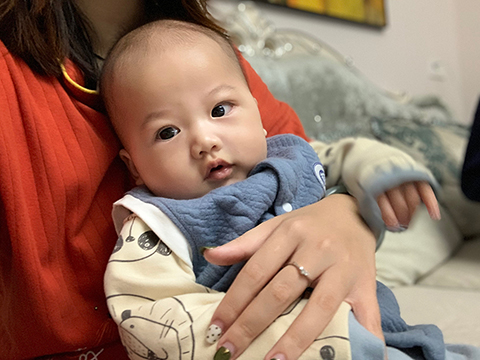
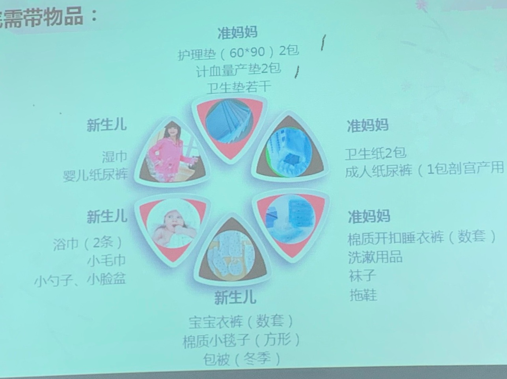
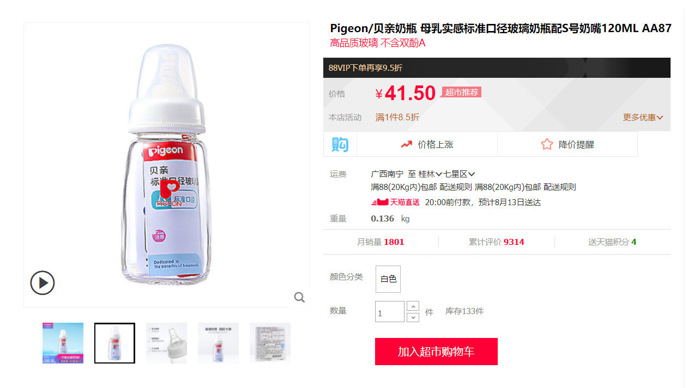
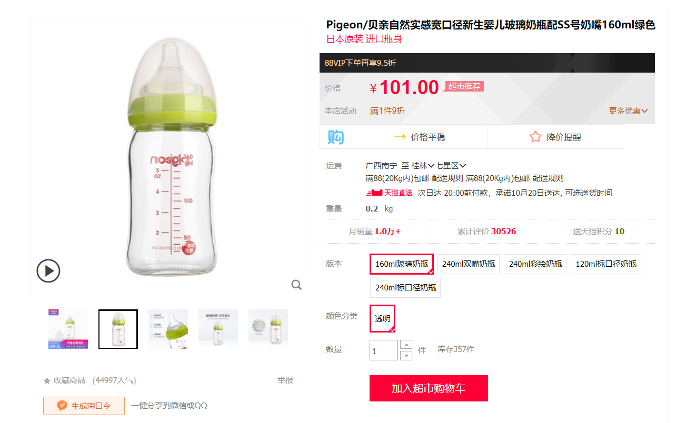
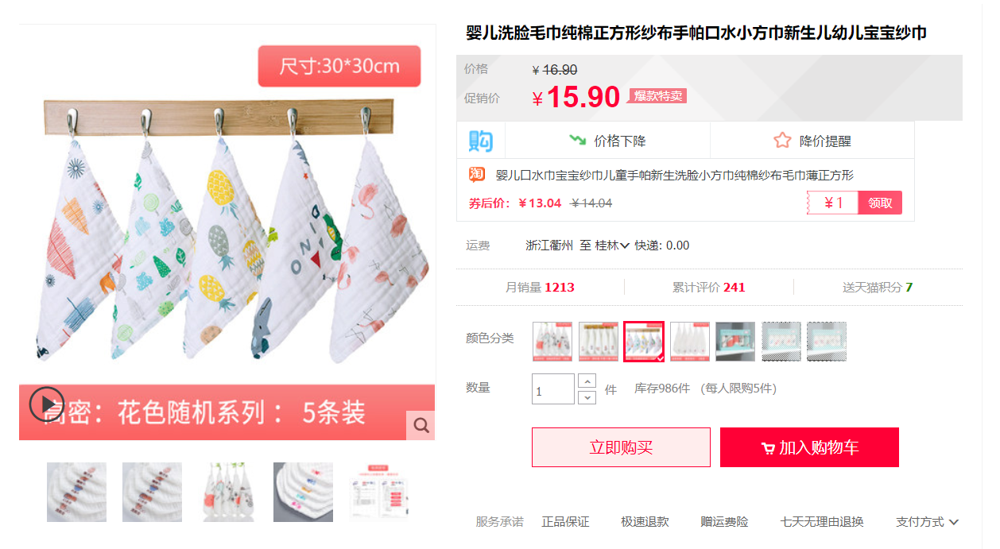
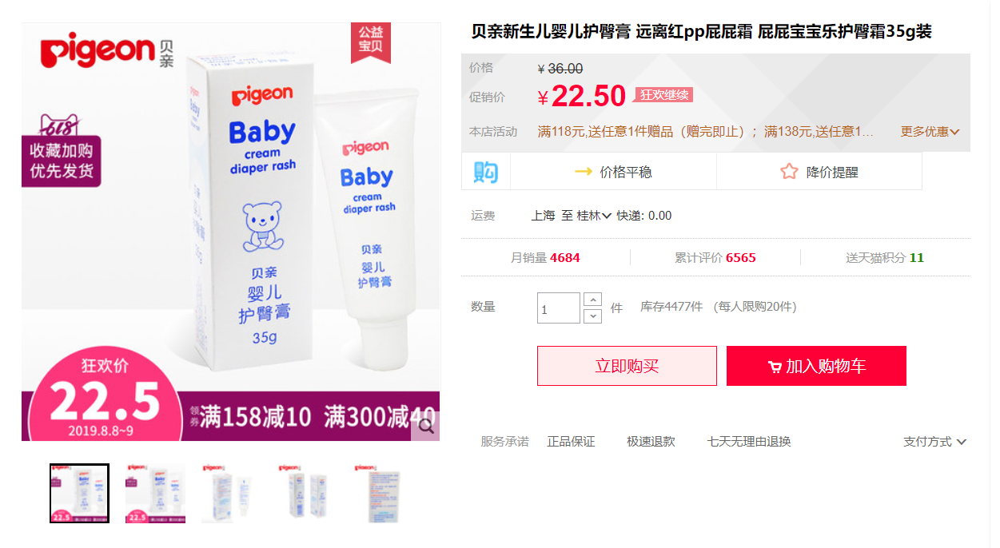
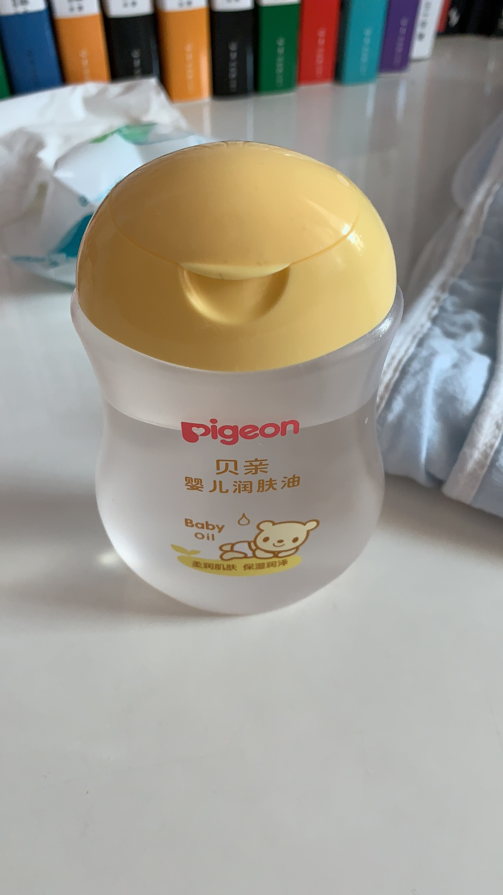
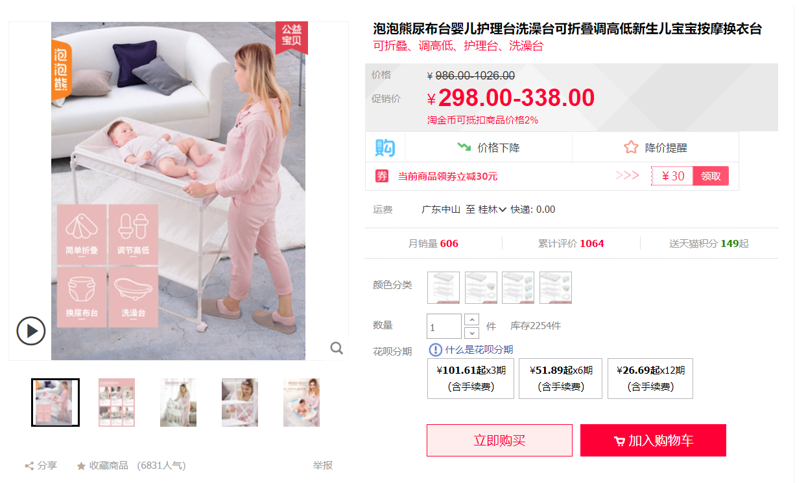
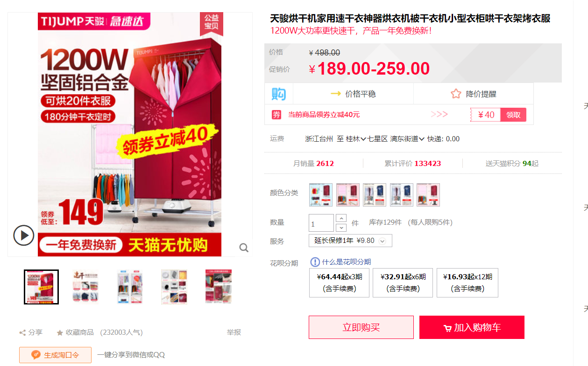
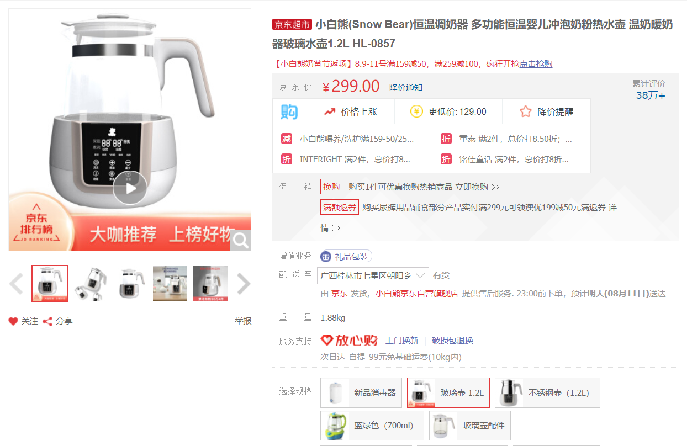

date: 2019-8-10
updated: 2019-10-1
tags: 

- 育儿

---

现在朱朱已经快百日了，刚好身边有朋友也要迎接新生命的到来，趁着这个时候写个笔记记录下当时一些要买的东西以及注意事项吧

小脸Q的不行

<!--more-->

# 购买物品清单

## 宝妈用的

- 宝妈哺乳内衣

三件以上，选前扣的比较方便

- 防溢乳贴

宝妈有奶水以后很容易溢奶，如果不想胸前湿哒哒的话买防溢乳贴，推荐十月结晶旗舰店

* 一次性储奶袋和吸奶器

喂完奶后尽量再用吸奶器吸空，防止乳汁积累形成肿块，超级痛，还容易发烧

一次性储奶袋推荐十月结晶旗舰店，便宜又好用

- 待产包

提前一个月准备，可以选择直接淘宝买待产包套餐，再根据下图补充，一次性内裤可以多准备点，多买夜用卫生巾

## 宝宝用的

* 婴儿衣服

十套以上，方便换洗，根据经验最好选择连体衣，适合新手父母换，上下装的裤子穿脱超级麻烦

* 一段奶粉一罐

宝妈刚生完崽的时候是没有奶的，崽崽刚出来的时候是需要两小时喂一次奶，每次20~30ml这样，需要一点奶粉过渡，我们家现在买的是诺优能一段的，荷兰进口，国内有行货版，统一价218一罐，选择这个主要是吃了不上火，小崽子肠胃也没啥问题

* 湿纸巾

小崽子每次换尿布的时候需要打一盆温水，然后把湿纸巾放进去润湿，大概拧干再去擦小崽子的PP，这货用量不少，备多点吧

* 奶瓶

最好提前买，别去街上母婴店随便挑，推荐贝亲的，身边的宝妈都是推荐这个，刚出生的小崽子每次最多喂个几十ml，先买这个备着就好了，等崽子大一点再买容量大的，最好买两只，防止你把这只摔了找不到备用的，而且另一只也可以拿来给小崽子喂完奶后喂水

[传送门](https://chaoshi.detail.tmall.com/item.htm?spm=a230r.1.14.22.61a87b09A6I3ro&id=21151408887&ns=1&abbucket=3)

> 贝亲的奶瓶经常搞活动，他家的高品质奶瓶，日常价100+的有时候甚至打五折，可以关注下

等宝宝大一点以后，推荐贝亲家的宽口径奶瓶！！！巨TM好用！160ML足矣，建议买一只玻璃的一只PPSU的，方便一只喂奶一只喝水，玻璃材质的热奶快，手感好，PPSU摔不破，耐高温，也是预备防止玻璃的摔了没有替换的。

这玩意低价的时候大概在七十多块钱一只，偶尔有活动的时候也是能做到100块两只，买的时候可以顺便屯点奶嘴，定期更换的。

* 尿不湿

这个品牌很多，按照自己承受能力来，国产的大概在五毛一片，进口的一块多，我是趁着618屯了可以用到双十一的分量，刚出生的崽子穿的是NB（初生号）

* 纸巾

这个就不用多说了

* 纱巾（口水围）

这个，买多点，喂奶的时候拿来垫在脖子上，小孩子容易吐奶，湿了就要换，口水围推荐用棉纱的，吸水性强，好清洗，不容易残留奶臭

[传送门](https://detail.tmall.com/item.htm?id=596287687343&spm=a1z09.2.0.0.3ee92e8dWdnsgH&_u=a1il3hvr7ed3&skuId=4311339143669)

* 护臀膏&茶油

小崽子在坐月子这段时间很容易红屁屁，每次换完尿布涂一下这个，很有效，就算红屁屁，一两天也就消下去了

还是推荐贝亲的！好用不贵！[传送门](https://detail.tmall.com/item.htm?id=524713769947&spm=a1z09.2.0.0.3ee92e8dWdnsgH&_u=a1il3hvrd97f)

* 按摩油

还是推荐贝亲家的，洗完澡要擦

* 棉签

清理耳屎和鼻屎

## 其他

* 加湿器

婴幼儿最好睡觉的地方湿度偏高点（55-70）不然鼻子口腔内干燥不利于呼吸系统发育，空调房一定要用

现在我家的做法是配合米家智能插座以及温湿度计，当湿度发生变化时联动加湿器开关，我只需要按时加水就好（直接买那种自带湿度控制的也行，我现在是充分利用家里的智能家居，只需要买个便宜的加湿器就行）

- 尿布台婴儿护理台

这个！！巨特么推荐了！拯救你的腰！！！

崽崽刚出生的时候，我一直都是把崽子放床上换的尿布，然后两天过去了，我一个二十多岁的年轻人居然觉得！腰疼！然后这玩意！可以让我不用在弯腰了！

一开始看到这么贵我还有点担心，但是实际使用我是要吹爆的！而且做工超棒，用的管子都很有分量，上面还能放澡盆！可折叠，不用的时候可以收起来，不过这种高频率使用的东西我是懒得收，反正下面有轮子可以到处推来推去！

- 烘干机

如果当地湿气重或者说是梅雨天气的话，建议买个简易烘干机，我家用的这个，传送门在[这里](https://detail.tmall.com/item.htm?id=528405028168&spm=a1z09.2.0.0.3c8b2e8d8LI7Mr&_u=a1il3hvrffc8#)

小孩子衣服最好高温烘干过再用，也干得快

* 恒温冲奶器

配方奶粉是有标配冲奶温度的，新手父母配比冲奶用的热水肯定不太ok，这个时候一个能够精确控温的热水壶就显得尤为重要。推荐下面这个，可以自动沸腾然后再恒温到某个温度，记得买容量大点的，至于说要玻璃瓶身还是不锈钢的就看你们自己喜欢了

